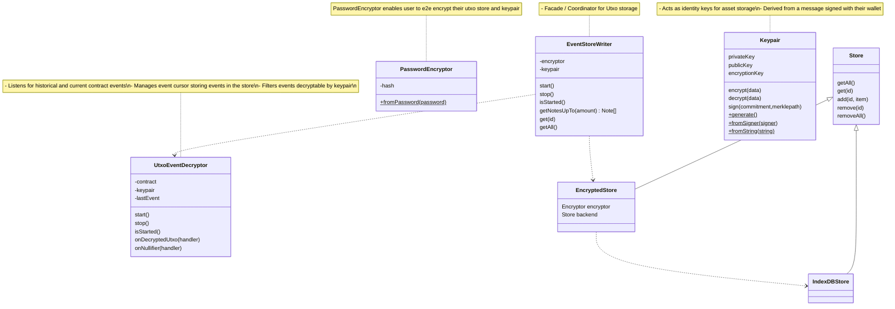

<p align="center"><h1 align="center">zrclib 🔮</h1></p>

## Mission

To bring zero knowledge privacy primitives to all web3 developers.

This code is unaudited.

## Roadmap

- [ ] ZRC-20 (Token & Payment)
- [ ] Stable Coin Example
- [ ] ZRC-1155 (Payment / Swap / NFTS / Airdrops)

### Prerequisites

- pnpm (8.2.0+)
- circom (2.1.5+)
- b2sum (8.3.2+)

### Install dependencies

```
pnpm install
```

### Run tests

```
pnpm test
```

- Run integration tests

### Build project

```
pnpm build
```

- Build circuit artifacts
- Bundle all keys encoded to json files

###

## API

```ts
// Get the standard ethers contract
const token = await ethers.Contract(address, abi, signer);

const account = Account.create(token, "password123");
await account.loginWithEthersSigner(signer);

expect(account.isLoggedIn()).toBe(true);

// Generate proof that shields 1 token
// Call the deposit method on the contract which will
// call `transferFrom` to spend 1 of your ERC-20 tokens and
// commit the transaction. If the transfer fails the transaction will fail
const shieldProof = await account.proveShield(1e18);
await token.deposit(shieldProof);

// Generate proof that sends 0.5 tokens to toAddress
const transferProof = await account.proveTransfer(5e17, receiver);

// Call the transfer method on the contract which will
// verify and commit the transaction
await token.tranfer(transferProof);

// Generate proof that burns 0.5 tokens to the receiver address
const unshieldProof = await account.proveUnshield(5e17, receiver);

// Call the withdraw method on the contract which will
// call `transferFrom` to return 0.5 of your ERC-20 tokens to your public account
await token.withdraw(unshieldProof);
```

## Architecture

### EventStoreWriter

The EventStoreWriter is an encrypted store for your private note information as well as your keypair. This data is encrypted with AES-256 and stored in indexDB in the browser and [keyv](keyvhq.js.org) storage strategies are possible serverside (ie. MySQL, PostgreSQL, SQLite, Redis, Mongo, DynamoDB, Firestore, Memcached, and more).



## Defiant Pool

Defiant pool is a feature that separates the pool's state from the public funds that are locked within it. The output is that the deposit funds for every transaction is held in a different address making it more difficult to censor via address. This makes it difficult to isolate all the addresses that comprise of the protocol as the address count grows with every deposit.

Future iteration can use recursion proving systems to prove in zero knowledge to the state contract that a deposit has been deployed. Depositors can then broadcast events that are only decypherable via threshold network. This would mean that getting a list of deposit addresses would be impossible making the protocol unsancitionable.


