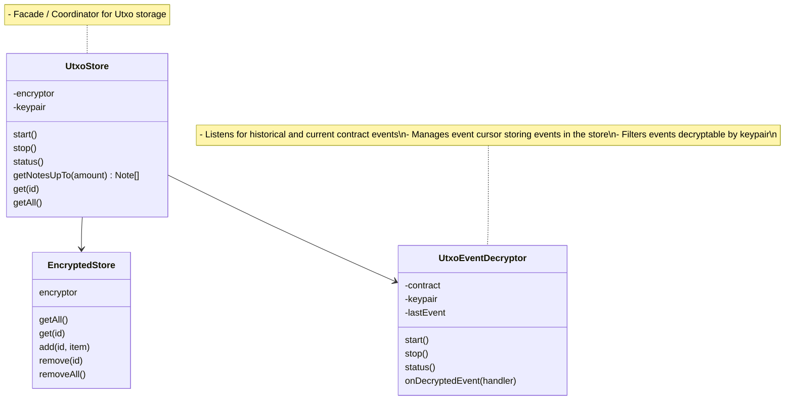

<p align="center"><h1 align="center">zrclib 🔮</h1></p>

## Mission

To bring zero knowledge privacy primitives to all web3 developers.

## Roadmap

- [ ] ZRC-20 (Token & Payment)
- [ ] Stable Coin Example
- [ ] ZRC-1155 (Payment / Swap / NFTS / Airdrops)

### Prerequisites

- pnpm (8.2.0+)
- circom (2.1.5+)
- b2sum (8.3.2+)

### Install dependencies

```
pnpm install
```

### Run tests

```
pnpm test
```

- Run integration tests

### Build project

```
pnpm build
```

- Build circuit artifacts
- Bundle all keys encoded to json files

## API

```ts
// Get the standard ethers contract
const token = await ethers.Contract(address, abi, signer);

const account = ShieldedAccount.from(signer);

if (!account.loggedIn()) {
  await account.login(); // Request Wallet to sign message
}

// create shieldedPool object
const prover = ShieldedPool.getProver(account);

// Generate proof that shields 1 token
// Call the deposit method on the contract which will
// call `transferFrom` to spend 1 of your ERC-20 tokens and
// commit the transaction. If the transfer fails the transaction will fail
const shieldProof = await prover.proveShield(1e18);
await token.deposit(shieldProof);

// Generate proof that sends 0.5 tokens to toAddress
const transferProof = await prover.proveTransfer(5e17, receiver);

// Call the transfer method on the contract which will
// verify and commit the transaction
await token.tranfer(transferProof);

// Generate proof that burns 0.5 tokens to the receiver address
const unshieldProof = await prover.proveUnshield(5e17, receiver);

// Call the withdraw method on the contract which will
// call `transferFrom` to return 0.5 of your ERC-20 tokens to your public account
await token.withdraw(unshieldProof);
```

## Architecture

### UtxoStore


