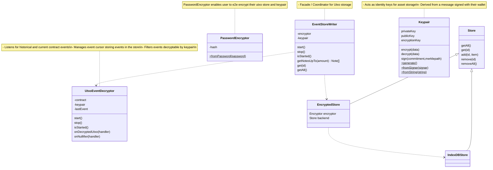

## Architecture

### EventStoreWriter

The EventStoreWriter is an encrypted store for your private note information as well as your keypair. This data is encrypted with AES-256 and stored in indexDB in the browser and [keyv](keyvhq.js.org) storage strategies are possible serverside (ie. MySQL, PostgreSQL, SQLite, Redis, Mongo, DynamoDB, Firestore, Memcached, and more).

