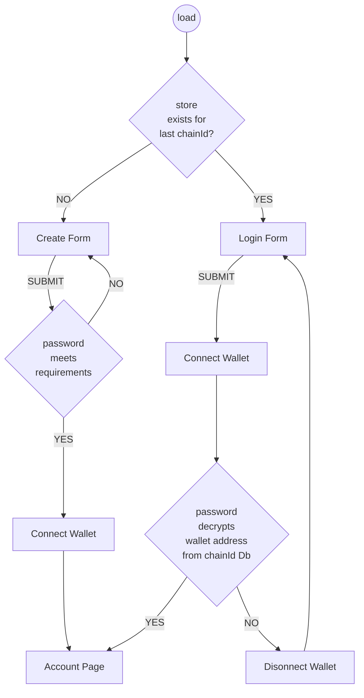

The login flow for the web app can be complex. Here it is in diagram form:

```mermaid

flowchart
    AA((load)) --> FIRSTTIME
    FIRSTTIME{store \nexists for \nlast chainId?}
    CREATE[Create Form]
    LOGIN[Login Form]
    REGX{password \nmeets \nrequirements}
    DECRYPT{password \ndecrypts \nwallet address \nfrom chainId Db}
    ACCOUNT[Account Page]
    CONNECT1[Connect Wallet]
    CONNECT2[Connect Wallet]
    DISCONNECT2[Disonnect Wallet]


    FIRSTTIME --NO--> CREATE
    FIRSTTIME --YES--> LOGIN
    CREATE --SUBMIT--> REGX
    LOGIN --SUBMIT--> CONNECT2
    DISCONNECT2 --> LOGIN
    CONNECT2 --> DECRYPT
    REGX --YES-->CONNECT1
    REGX --NO-->CREATE
    CONNECT1 --> ACCOUNT
    DECRYPT --YES--> ACCOUNT
    DECRYPT --NO--> DISCONNECT2

```
