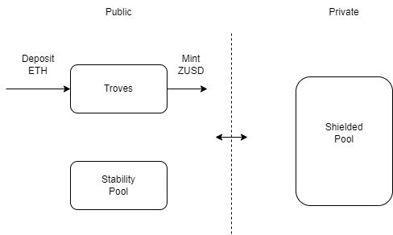

# Private decentralized stablecoin

In this example, we created a private decentralized stablecoin named as ZUSD, using some of the mechanism from [Liquity](https://docs.liquity.org/). Users can deposit ETH as collateral and mint ZUSD in an overcollaterized fashion. ZUSD can exist publicly and privately. Minting ZUSD or redeeming the collateral occurs publicly, while users also have the option to deposit ZUSD into a shielded pool, where subsequent interactions will then be private.



### Integration with ZRCLib

Using ZRCLib, a shielded pool can be easily integrated into the stablecoin design. We simply add a function interface to the `ZUSD.sol` contract which takes in a zero knowledge proof. 

```
/**
 * notice Interface for ZUSD to and from the shielded pool
 * If deposit, subsequent transfer will be private in the shielded pool
 * If withdraw, subsequent transfer will be normal ERC20 token transfer
 */
function transact(Proof calldata _proof) public {
    // Deposit functionality
    if (_proof.extData.extAmount > 0) {
        _spendAllowance(msg.sender, address(this), uint256(_proof.extData.extAmount));
        _transfer(msg.sender, address(this), uint256(_proof.extData.extAmount));
    }

    // Proof determines whether we add to or remove from pool
    _transact(_proof);

    // Withdrawal functionality
    if (_proof.extData.extAmount < 0) {
        require(
            _proof.extData.recipient != address(0),
            "Can't withdraw to zero address"
        );

        _transfer(msg.sender, _proof.extData.recipient,uint256(_proof.extData.extAmount));
    }
}
```

To call this function, you will also need to integrate with ZRCLib SDK. 

```
// Create shielded pool account
account = await ShieldedAccount.create(zusd, "password123");
await account.loginWithEthersSigner(user);
const prover = account.getProver();
const initialZUSDBalance = await zusd.balanceOf(user.address);

// Create proof
const deposit = ethers.utils.parseUnits("500", zusdDecimals);
const shieldProof = await prover.shield(deposit);

// call transact function
await zusd.approve(zusd.address, ethers.utils.parseEther("1000"));
await zusd.transact(shieldProof);
```

### Running the tests

More details on ZRCLib integration can be seen in the test files. Run `npx hardhat test`. 
